# Layout gallery

| thumb | name | family | size | seed | method | params | passage width | ref. path len | diag. fixes | decode | topology | images |
|---|---|---|---|---|---|---|---|---|---|---|---|---|
| 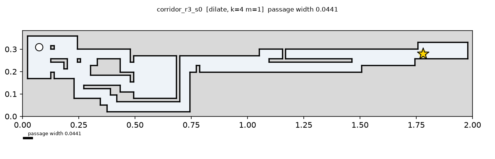 | corridor_r3_s0 | corridor | r3 | 0 | dilate | k=4 m=1 | 0.0441 | 2.265 | 1 | n/a | pass (shortcuts 0/21736) | [raw](grid/corridor_r3_s0_dilate_k4m1_raw.png) · [widened](grid/corridor_r3_s0_dilate_k4m1_widened.png) · [cont](continuous/corridor_r3_s0_dilate_k4m1.png) · [svg](continuous/corridor_r3_s0_dilate_k4m1.svg) · [roadmap](continuous/corridor_r3_s0_dilate_k4m1_roadmap.png) · [preview](previews/corridor_r3_s0_dilate_k4m1.png) |
| 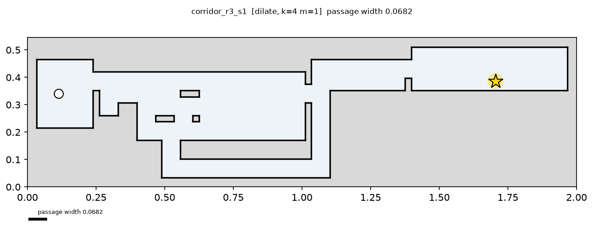 | corridor_r3_s1 | corridor | r3 | 1 | dilate | k=4 m=1 | 0.0682 | 1.818 | 0 | n/a | pass (shortcuts 0/12880) | [raw](grid/corridor_r3_s1_dilate_k4m1_raw.png) · [widened](grid/corridor_r3_s1_dilate_k4m1_widened.png) · [cont](continuous/corridor_r3_s1_dilate_k4m1.png) · [svg](continuous/corridor_r3_s1_dilate_k4m1.svg) · [roadmap](continuous/corridor_r3_s1_dilate_k4m1_roadmap.png) · [preview](previews/corridor_r3_s1_dilate_k4m1.png) |
| 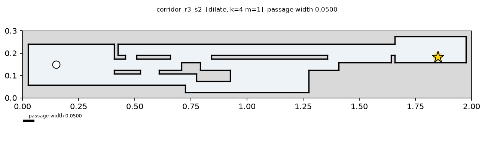 | corridor_r3_s2 | corridor | r3 | 2 | dilate | k=4 m=1 | 0.0500 | 1.800 | 0 | n/a | pass (shortcuts 0/21736) | [raw](grid/corridor_r3_s2_dilate_k4m1_raw.png) · [widened](grid/corridor_r3_s2_dilate_k4m1_widened.png) · [cont](continuous/corridor_r3_s2_dilate_k4m1.png) · [svg](continuous/corridor_r3_s2_dilate_k4m1.svg) · [roadmap](continuous/corridor_r3_s2_dilate_k4m1_roadmap.png) · [preview](previews/corridor_r3_s2_dilate_k4m1.png) |
| 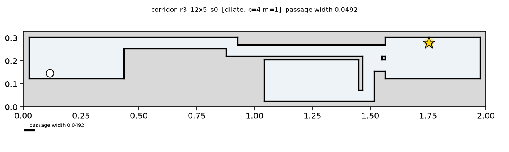 | corridor_r3_12x5_s0 | corridor | r3_12x5 | 0 | dilate | k=4 m=1 | 0.0492 | 1.836 | 0 | n/a | pass (shortcuts 0/25425) | [raw](grid/corridor_r3_12x5_s0_dilate_k4m1_raw.png) · [widened](grid/corridor_r3_12x5_s0_dilate_k4m1_widened.png) · [cont](continuous/corridor_r3_12x5_s0_dilate_k4m1.png) · [svg](continuous/corridor_r3_12x5_s0_dilate_k4m1.svg) · [roadmap](continuous/corridor_r3_12x5_s0_dilate_k4m1_roadmap.png) · [preview](previews/corridor_r3_12x5_s0_dilate_k4m1.png) |
| 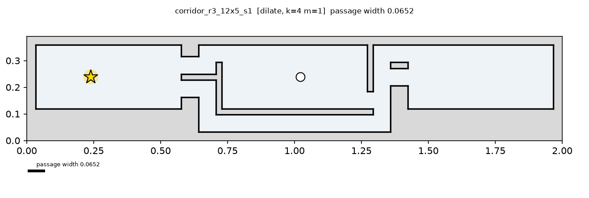 | corridor_r3_12x5_s1 | corridor | r3_12x5 | 1 | dilate | k=4 m=1 | 0.0652 | 0.957 | 0 | n/a | pass (shortcuts 0/23436) | [raw](grid/corridor_r3_12x5_s1_dilate_k4m1_raw.png) · [widened](grid/corridor_r3_12x5_s1_dilate_k4m1_widened.png) · [cont](continuous/corridor_r3_12x5_s1_dilate_k4m1.png) · [svg](continuous/corridor_r3_12x5_s1_dilate_k4m1.svg) · [roadmap](continuous/corridor_r3_12x5_s1_dilate_k4m1_roadmap.png) · [preview](previews/corridor_r3_12x5_s1_dilate_k4m1.png) |
| 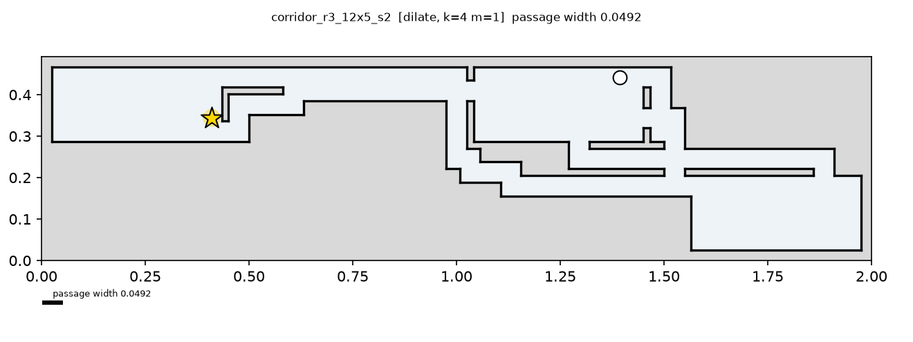 | corridor_r3_12x5_s2 | corridor | r3_12x5 | 2 | dilate | k=4 m=1 | 0.0492 | 1.148 | 0 | n/a | pass (shortcuts 0/37950) | [raw](grid/corridor_r3_12x5_s2_dilate_k4m1_raw.png) · [widened](grid/corridor_r3_12x5_s2_dilate_k4m1_widened.png) · [cont](continuous/corridor_r3_12x5_s2_dilate_k4m1.png) · [svg](continuous/corridor_r3_12x5_s2_dilate_k4m1.svg) · [roadmap](continuous/corridor_r3_12x5_s2_dilate_k4m1_roadmap.png) · [preview](previews/corridor_r3_12x5_s2_dilate_k4m1.png) |
| 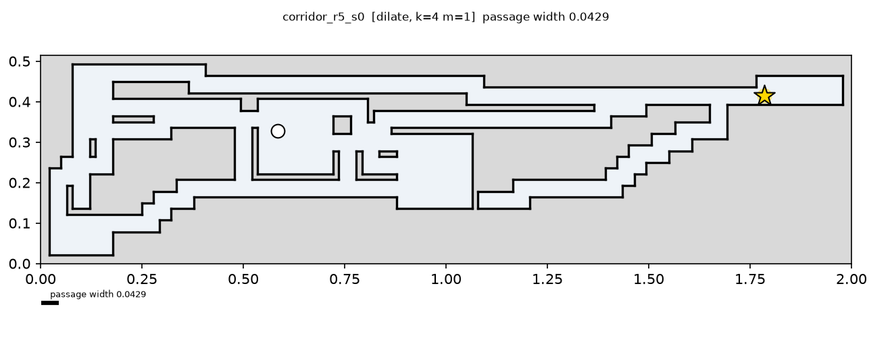 | corridor_r5_s0 | corridor | r5 | 0 | dilate | k=4 m=1 | 0.0429 | 1.343 | 0 | n/a | pass (shortcuts 0/52326) | [raw](grid/corridor_r5_s0_dilate_k4m1_raw.png) · [widened](grid/corridor_r5_s0_dilate_k4m1_widened.png) · [cont](continuous/corridor_r5_s0_dilate_k4m1.png) · [svg](continuous/corridor_r5_s0_dilate_k4m1.svg) · [roadmap](continuous/corridor_r5_s0_dilate_k4m1_roadmap.png) · [preview](previews/corridor_r5_s0_dilate_k4m1.png) |
| 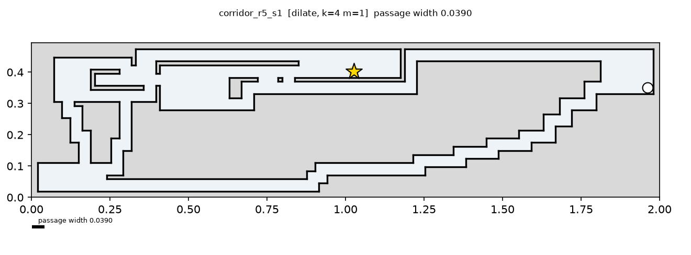 | corridor_r5_s1 | corridor | r5 | 1 | dilate | k=4 m=1 | 0.0390 | 1.610 | 1 | n/a | pass (shortcuts 0/63190) | [raw](grid/corridor_r5_s1_dilate_k4m1_raw.png) · [widened](grid/corridor_r5_s1_dilate_k4m1_widened.png) · [cont](continuous/corridor_r5_s1_dilate_k4m1.png) · [svg](continuous/corridor_r5_s1_dilate_k4m1.svg) · [roadmap](continuous/corridor_r5_s1_dilate_k4m1_roadmap.png) · [preview](previews/corridor_r5_s1_dilate_k4m1.png) |
| 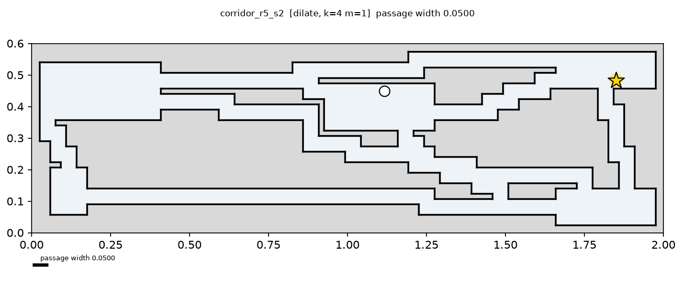 | corridor_r5_s2 | corridor | r5 | 2 | dilate | k=4 m=1 | 0.0500 | 0.900 | 0 | n/a | pass (shortcuts 0/58653) | [raw](grid/corridor_r5_s2_dilate_k4m1_raw.png) · [widened](grid/corridor_r5_s2_dilate_k4m1_widened.png) · [cont](continuous/corridor_r5_s2_dilate_k4m1.png) · [svg](continuous/corridor_r5_s2_dilate_k4m1.svg) · [roadmap](continuous/corridor_r5_s2_dilate_k4m1_roadmap.png) · [preview](previews/corridor_r5_s2_dilate_k4m1.png) |
| 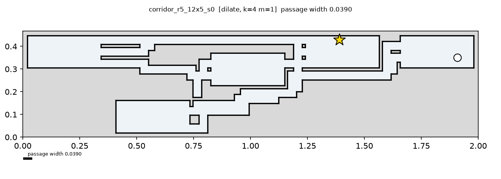 | corridor_r5_12x5_s0 | corridor | r5_12x5 | 0 | dilate | k=4 m=1 | 0.0390 | 1.117 | 0 | n/a | pass (shortcuts 0/102378) | [raw](grid/corridor_r5_12x5_s0_dilate_k4m1_raw.png) · [widened](grid/corridor_r5_12x5_s0_dilate_k4m1_widened.png) · [cont](continuous/corridor_r5_12x5_s0_dilate_k4m1.png) · [svg](continuous/corridor_r5_12x5_s0_dilate_k4m1.svg) · [roadmap](continuous/corridor_r5_12x5_s0_dilate_k4m1_roadmap.png) · [preview](previews/corridor_r5_12x5_s0_dilate_k4m1.png) |
| 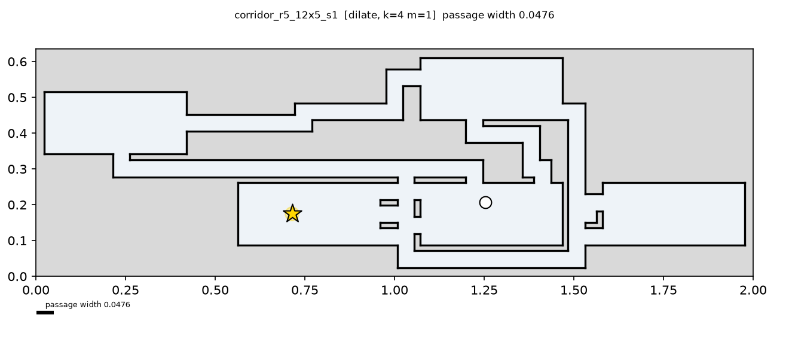 | corridor_r5_12x5_s1 | corridor | r5_12x5 | 1 | dilate | k=4 m=1 | 0.0476 | 0.635 | 0 | n/a | pass (shortcuts 0/88410) | [raw](grid/corridor_r5_12x5_s1_dilate_k4m1_raw.png) · [widened](grid/corridor_r5_12x5_s1_dilate_k4m1_widened.png) · [cont](continuous/corridor_r5_12x5_s1_dilate_k4m1.png) · [svg](continuous/corridor_r5_12x5_s1_dilate_k4m1.svg) · [roadmap](continuous/corridor_r5_12x5_s1_dilate_k4m1_roadmap.png) · [preview](previews/corridor_r5_12x5_s1_dilate_k4m1.png) |
| 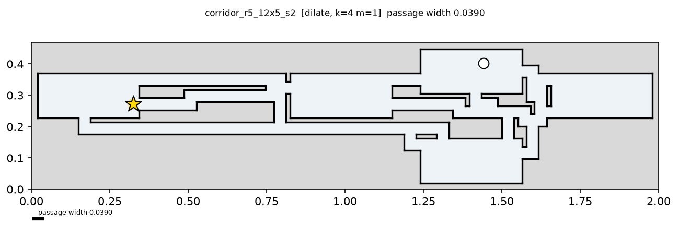 | corridor_r5_12x5_s2 | corridor | r5_12x5 | 2 | dilate | k=4 m=1 | 0.0390 | 1.247 | 2 | n/a | pass (shortcuts 0/97461) | [raw](grid/corridor_r5_12x5_s2_dilate_k4m1_raw.png) · [widened](grid/corridor_r5_12x5_s2_dilate_k4m1_widened.png) · [cont](continuous/corridor_r5_12x5_s2_dilate_k4m1.png) · [svg](continuous/corridor_r5_12x5_s2_dilate_k4m1.svg) · [roadmap](continuous/corridor_r5_12x5_s2_dilate_k4m1_roadmap.png) · [preview](previews/corridor_r5_12x5_s2_dilate_k4m1.png) |
| 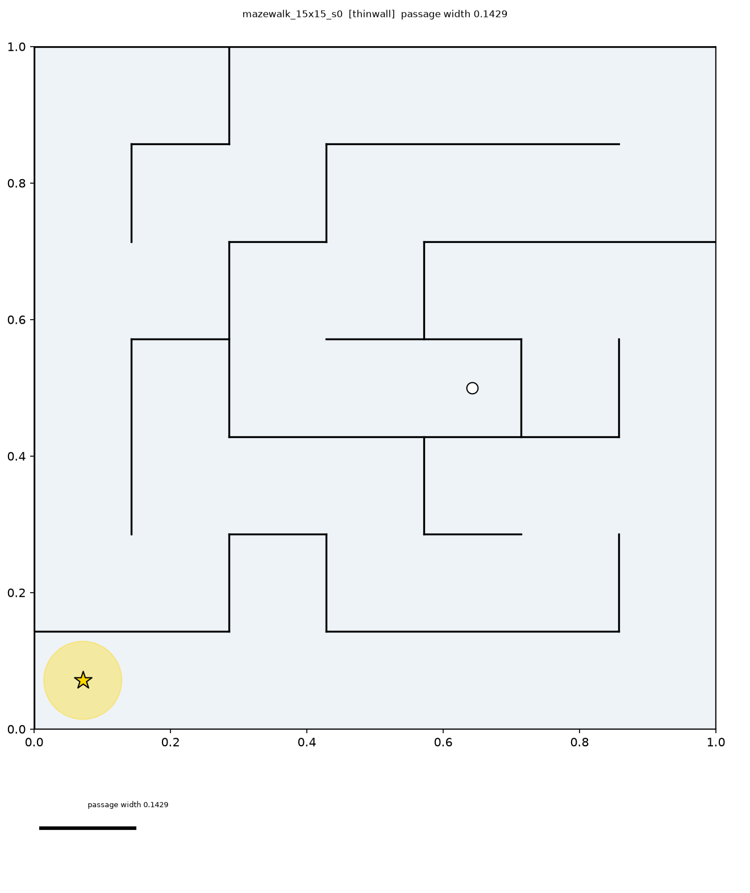 | mazewalk_15x15_s0 | mazewalk | 15x15 | 0 | thinwall |  | 0.1429 | 5.286 | 0 | ok | pass (shortcuts 0/4656) | [raw](grid/mazewalk_15x15_s0_thinwall_raw.png) · [widened](grid/mazewalk_15x15_s0_thinwall_widened.png) · [cont](continuous/mazewalk_15x15_s0_thinwall.png) · [svg](continuous/mazewalk_15x15_s0_thinwall.svg) · [roadmap](continuous/mazewalk_15x15_s0_thinwall_roadmap.png) · [preview](previews/mazewalk_15x15_s0_thinwall.png) |
| 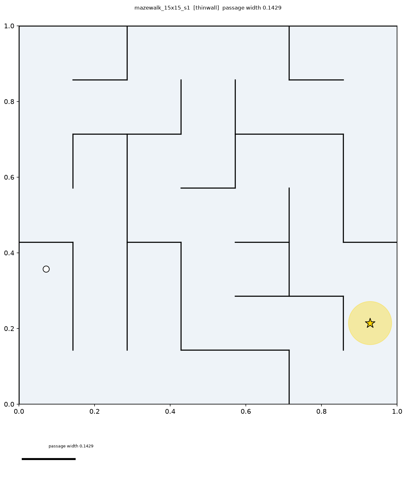 | mazewalk_15x15_s1 | mazewalk | 15x15 | 1 | thinwall |  | 0.1429 | 3.571 | 0 | ok | pass (shortcuts 0/4753) | [raw](grid/mazewalk_15x15_s1_thinwall_raw.png) · [widened](grid/mazewalk_15x15_s1_thinwall_widened.png) · [cont](continuous/mazewalk_15x15_s1_thinwall.png) · [svg](continuous/mazewalk_15x15_s1_thinwall.svg) · [roadmap](continuous/mazewalk_15x15_s1_thinwall_roadmap.png) · [preview](previews/mazewalk_15x15_s1_thinwall.png) |
| 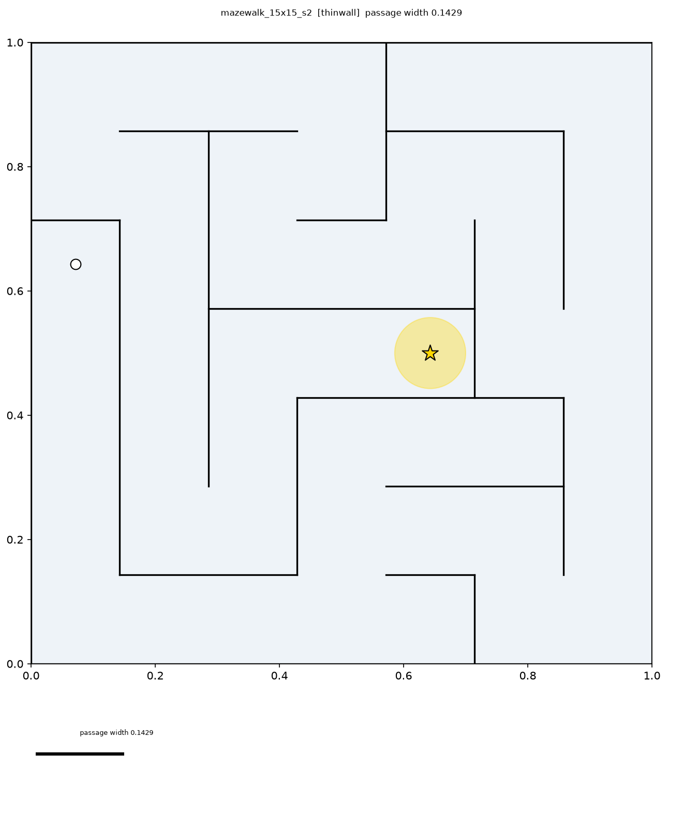 | mazewalk_15x15_s2 | mazewalk | 15x15 | 2 | thinwall |  | 0.1429 | 5.571 | 0 | ok | pass (shortcuts 0/4656) | [raw](grid/mazewalk_15x15_s2_thinwall_raw.png) · [widened](grid/mazewalk_15x15_s2_thinwall_widened.png) · [cont](continuous/mazewalk_15x15_s2_thinwall.png) · [svg](continuous/mazewalk_15x15_s2_thinwall.svg) · [roadmap](continuous/mazewalk_15x15_s2_thinwall_roadmap.png) · [preview](previews/mazewalk_15x15_s2_thinwall.png) |
| 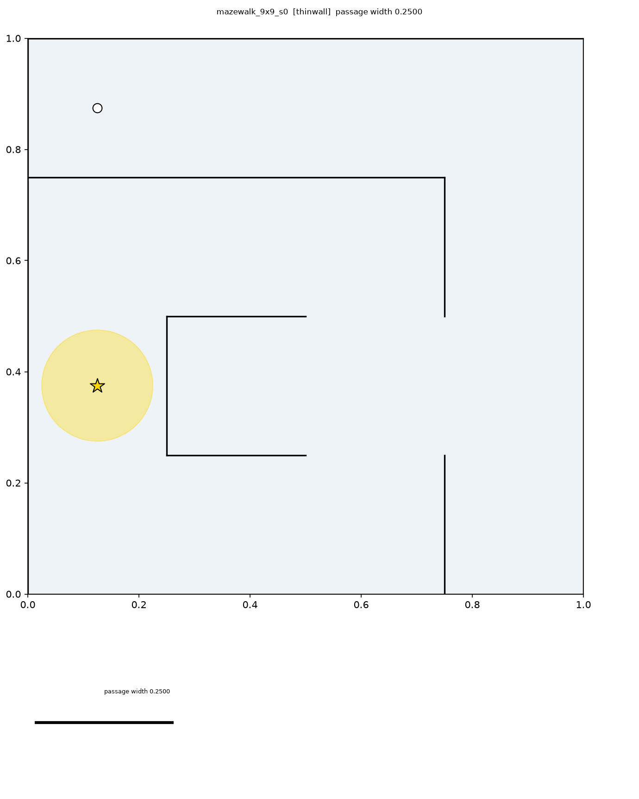 | mazewalk_9x9_s0 | mazewalk | 9x9 | 0 | thinwall |  | 0.2500 | 2.500 | 0 | ok | pass (shortcuts 0/496) | [raw](grid/mazewalk_9x9_s0_thinwall_raw.png) · [widened](grid/mazewalk_9x9_s0_thinwall_widened.png) · [cont](continuous/mazewalk_9x9_s0_thinwall.png) · [svg](continuous/mazewalk_9x9_s0_thinwall.svg) · [roadmap](continuous/mazewalk_9x9_s0_thinwall_roadmap.png) · [preview](previews/mazewalk_9x9_s0_thinwall.png) |
| 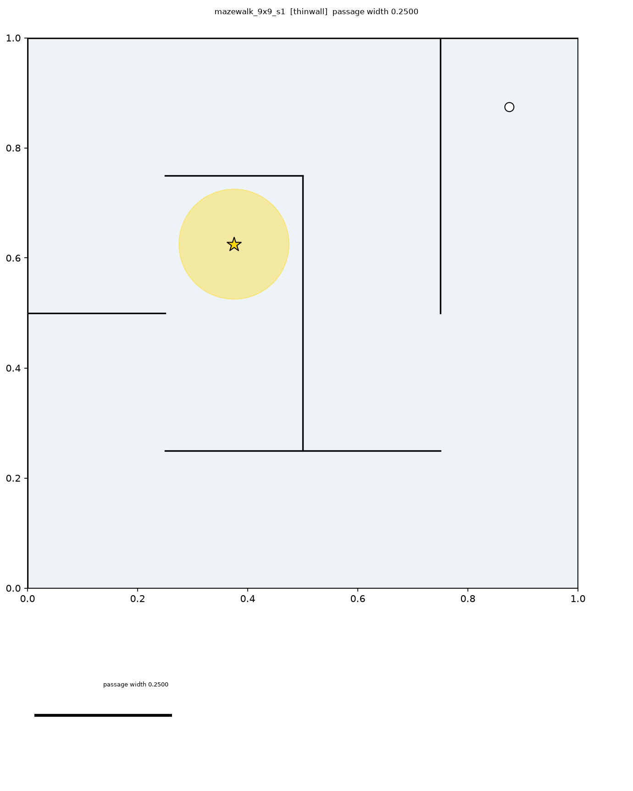 | mazewalk_9x9_s1 | mazewalk | 9x9 | 1 | thinwall |  | 0.2500 | 2.250 | 0 | ok | pass (shortcuts 0/496) | [raw](grid/mazewalk_9x9_s1_thinwall_raw.png) · [widened](grid/mazewalk_9x9_s1_thinwall_widened.png) · [cont](continuous/mazewalk_9x9_s1_thinwall.png) · [svg](continuous/mazewalk_9x9_s1_thinwall.svg) · [roadmap](continuous/mazewalk_9x9_s1_thinwall_roadmap.png) · [preview](previews/mazewalk_9x9_s1_thinwall.png) |
| 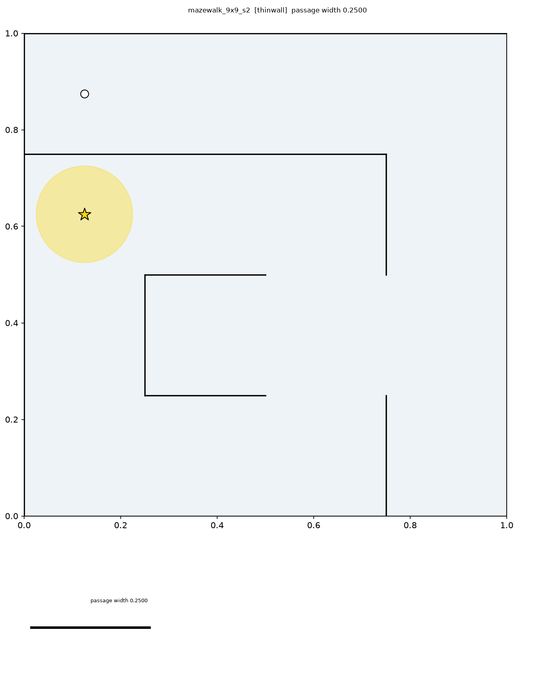 | mazewalk_9x9_s2 | mazewalk | 9x9 | 2 | thinwall |  | 0.2500 | 2.250 | 0 | ok | pass (shortcuts 0/496) | [raw](grid/mazewalk_9x9_s2_thinwall_raw.png) · [widened](grid/mazewalk_9x9_s2_thinwall_widened.png) · [cont](continuous/mazewalk_9x9_s2_thinwall.png) · [svg](continuous/mazewalk_9x9_s2_thinwall.svg) · [roadmap](continuous/mazewalk_9x9_s2_thinwall_roadmap.png) · [preview](previews/mazewalk_9x9_s2_thinwall.png) |
| 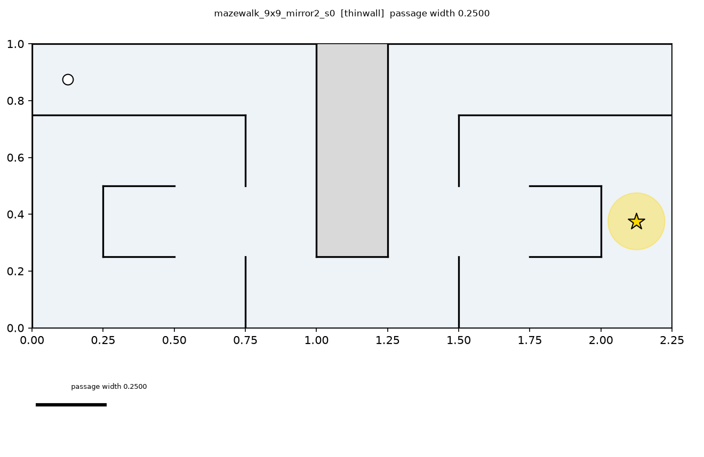 | mazewalk_9x9_mirror2_s0 | mazewalk | 9x9_mirror2 | 0 | thinwall |  | 0.2500 | 3.500 | 0 | ok | pass (shortcuts 0/2211) | [raw](grid/mazewalk_9x9_mirror2_s0_thinwall_raw.png) · [widened](grid/mazewalk_9x9_mirror2_s0_thinwall_widened.png) · [cont](continuous/mazewalk_9x9_mirror2_s0_thinwall.png) · [svg](continuous/mazewalk_9x9_mirror2_s0_thinwall.svg) · [roadmap](continuous/mazewalk_9x9_mirror2_s0_thinwall_roadmap.png) · [preview](previews/mazewalk_9x9_mirror2_s0_thinwall.png) |

Contact sheets: [corridor](gallery/corridor.png), [mazewalk](gallery/mazewalk.png)
